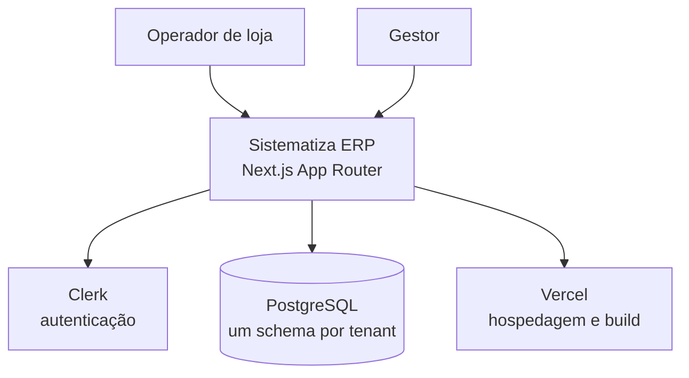
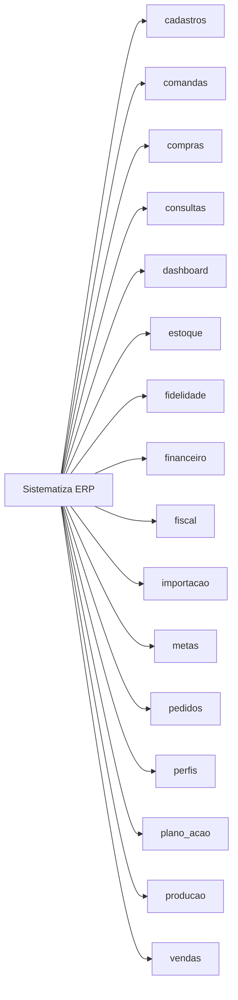

# Arquitetura — Sistematiza ERP

> Documento gerado por `scripts/gerar-diagramas.js` em 29/07/2026, 09:43:17.
> Não edite à mão: rode o script de novo depois de mudar o código.

## 1. Visão de contexto



## 2. Módulos e telas

| Módulo | Telas |
|---|---|
| cadastros | ClientesView, DominiosView, FichaTecnicaView, FormasPagamentoView, FornecedoresView, InsumosView, ProdutosView, UsuariosView |
| comandas | ComandasView |
| compras | CompraRapidaView, ComprasView, ConferenciaTab, CotacaoTab, ListasTab, MrpTab, PedidosTab, RequisicoesTab |
| consultas | ConsultasView |
| dashboard | DashboardHome |
| estoque | ContagemTab, EntradaNfeTab, EstoqueAvancadoView, EstoqueView, LocaisTab, PerdasTab |
| fidelidade | FidelidadeView |
| financeiro | ConciliacaoView, ContasPagarView, ContasReceberView, FinanceiroView |
| fiscal | FiscalView, NovaNotaModal |
| importacao | ImportacaoModal |
| metas | MetasView |
| pedidos | PedidosView |
| perfis | PerfisView |
| plano_acao | PlanoAcaoView |
| producao | ProducaoView |
| vendas | VendaDetalheView, VendasView |



## 3. Rotas de API

| Método | Rota | Arquivo |
|---|---|---|
| PUT | `/api/[tenant]/cadastros/clientes/[id]` | app/api/[tenant]/cadastros/clientes/[id]/route.ts |
| DELETE | `/api/[tenant]/cadastros/clientes/[id]` | app/api/[tenant]/cadastros/clientes/[id]/route.ts |
| GET | `/api/[tenant]/cadastros/clientes` | app/api/[tenant]/cadastros/clientes/route.ts |
| POST | `/api/[tenant]/cadastros/clientes` | app/api/[tenant]/cadastros/clientes/route.ts |
| DELETE | `/api/[tenant]/cadastros/clientes` | app/api/[tenant]/cadastros/clientes/route.ts |
| PUT | `/api/[tenant]/cadastros/formas-pagamento/[id]` | app/api/[tenant]/cadastros/formas-pagamento/[id]/route.ts |
| DELETE | `/api/[tenant]/cadastros/formas-pagamento/[id]` | app/api/[tenant]/cadastros/formas-pagamento/[id]/route.ts |
| GET | `/api/[tenant]/cadastros/formas-pagamento` | app/api/[tenant]/cadastros/formas-pagamento/route.ts |
| POST | `/api/[tenant]/cadastros/formas-pagamento` | app/api/[tenant]/cadastros/formas-pagamento/route.ts |
| PUT | `/api/[tenant]/cadastros/fornecedores/[id]` | app/api/[tenant]/cadastros/fornecedores/[id]/route.ts |
| DELETE | `/api/[tenant]/cadastros/fornecedores/[id]` | app/api/[tenant]/cadastros/fornecedores/[id]/route.ts |
| GET | `/api/[tenant]/cadastros/fornecedores` | app/api/[tenant]/cadastros/fornecedores/route.ts |
| POST | `/api/[tenant]/cadastros/fornecedores` | app/api/[tenant]/cadastros/fornecedores/route.ts |
| PUT | `/api/[tenant]/cadastros/insumos/[id]` | app/api/[tenant]/cadastros/insumos/[id]/route.ts |
| DELETE | `/api/[tenant]/cadastros/insumos/[id]` | app/api/[tenant]/cadastros/insumos/[id]/route.ts |
| GET | `/api/[tenant]/cadastros/insumos` | app/api/[tenant]/cadastros/insumos/route.ts |
| POST | `/api/[tenant]/cadastros/insumos` | app/api/[tenant]/cadastros/insumos/route.ts |
| GET | `/api/[tenant]/cadastros/produtos/[id]/composicao` | app/api/[tenant]/cadastros/produtos/[id]/composicao/route.ts |
| DELETE | `/api/[tenant]/cadastros/produtos/[id]/ficha/[itemId]` | app/api/[tenant]/cadastros/produtos/[id]/ficha/[itemId]/route.ts |
| GET | `/api/[tenant]/cadastros/produtos/[id]/ficha` | app/api/[tenant]/cadastros/produtos/[id]/ficha/route.ts |
| POST | `/api/[tenant]/cadastros/produtos/[id]/ficha` | app/api/[tenant]/cadastros/produtos/[id]/ficha/route.ts |
| PUT | `/api/[tenant]/cadastros/produtos/[id]` | app/api/[tenant]/cadastros/produtos/[id]/route.ts |
| DELETE | `/api/[tenant]/cadastros/produtos/[id]` | app/api/[tenant]/cadastros/produtos/[id]/route.ts |
| GET | `/api/[tenant]/cadastros/produtos` | app/api/[tenant]/cadastros/produtos/route.ts |
| POST | `/api/[tenant]/cadastros/produtos` | app/api/[tenant]/cadastros/produtos/route.ts |
| PUT | `/api/[tenant]/cadastros/usuarios/[id]/perfil` | app/api/[tenant]/cadastros/usuarios/[id]/perfil/route.ts |
| POST | `/api/[tenant]/cadastros/usuarios/[id]/reset-senha` | app/api/[tenant]/cadastros/usuarios/[id]/reset-senha/route.ts |
| PUT | `/api/[tenant]/cadastros/usuarios/[id]` | app/api/[tenant]/cadastros/usuarios/[id]/route.ts |
| DELETE | `/api/[tenant]/cadastros/usuarios/[id]` | app/api/[tenant]/cadastros/usuarios/[id]/route.ts |
| GET | `/api/[tenant]/cadastros/usuarios` | app/api/[tenant]/cadastros/usuarios/route.ts |
| POST | `/api/[tenant]/cadastros/usuarios` | app/api/[tenant]/cadastros/usuarios/route.ts |
| POST | `/api/[tenant]/comandas/[id]/cancelar` | app/api/[tenant]/comandas/[id]/cancelar/route.ts |
| POST | `/api/[tenant]/comandas/[id]/fechar` | app/api/[tenant]/comandas/[id]/fechar/route.ts |
| POST | `/api/[tenant]/comandas/[id]/itens` | app/api/[tenant]/comandas/[id]/itens/route.ts |
| GET | `/api/[tenant]/comandas/[id]` | app/api/[tenant]/comandas/[id]/route.ts |
| GET | `/api/[tenant]/comandas` | app/api/[tenant]/comandas/route.ts |
| POST | `/api/[tenant]/comandas` | app/api/[tenant]/comandas/route.ts |
| PUT | `/api/[tenant]/compras/[id]` | app/api/[tenant]/compras/[id]/route.ts |
| DELETE | `/api/[tenant]/compras/[id]` | app/api/[tenant]/compras/[id]/route.ts |
| GET | `/api/[tenant]/compras/conferencias/[id]` | app/api/[tenant]/compras/conferencias/[id]/route.ts |
| PUT | `/api/[tenant]/compras/conferencias/[id]` | app/api/[tenant]/compras/conferencias/[id]/route.ts |
| GET | `/api/[tenant]/compras/conferencias` | app/api/[tenant]/compras/conferencias/route.ts |
| POST | `/api/[tenant]/compras/conferencias` | app/api/[tenant]/compras/conferencias/route.ts |
| GET | `/api/[tenant]/compras/cotacoes/[id]` | app/api/[tenant]/compras/cotacoes/[id]/route.ts |
| POST | `/api/[tenant]/compras/cotacoes/[id]` | app/api/[tenant]/compras/cotacoes/[id]/route.ts |
| PUT | `/api/[tenant]/compras/cotacoes/[id]` | app/api/[tenant]/compras/cotacoes/[id]/route.ts |
| DELETE | `/api/[tenant]/compras/cotacoes/[id]` | app/api/[tenant]/compras/cotacoes/[id]/route.ts |
| GET | `/api/[tenant]/compras/cotacoes` | app/api/[tenant]/compras/cotacoes/route.ts |
| POST | `/api/[tenant]/compras/cotacoes` | app/api/[tenant]/compras/cotacoes/route.ts |
| GET | `/api/[tenant]/compras/listas/[id]` | app/api/[tenant]/compras/listas/[id]/route.ts |
| PUT | `/api/[tenant]/compras/listas/[id]` | app/api/[tenant]/compras/listas/[id]/route.ts |
| DELETE | `/api/[tenant]/compras/listas/[id]` | app/api/[tenant]/compras/listas/[id]/route.ts |
| GET | `/api/[tenant]/compras/listas` | app/api/[tenant]/compras/listas/route.ts |
| POST | `/api/[tenant]/compras/listas` | app/api/[tenant]/compras/listas/route.ts |
| GET | `/api/[tenant]/compras/mrp` | app/api/[tenant]/compras/mrp/route.ts |
| POST | `/api/[tenant]/compras/mrp` | app/api/[tenant]/compras/mrp/route.ts |
| GET | `/api/[tenant]/compras/pedidos/[id]` | app/api/[tenant]/compras/pedidos/[id]/route.ts |
| PUT | `/api/[tenant]/compras/pedidos/[id]` | app/api/[tenant]/compras/pedidos/[id]/route.ts |
| DELETE | `/api/[tenant]/compras/pedidos/[id]` | app/api/[tenant]/compras/pedidos/[id]/route.ts |
| GET | `/api/[tenant]/compras/pedidos` | app/api/[tenant]/compras/pedidos/route.ts |
| POST | `/api/[tenant]/compras/pedidos` | app/api/[tenant]/compras/pedidos/route.ts |
| PUT | `/api/[tenant]/compras/requisicoes/[id]` | app/api/[tenant]/compras/requisicoes/[id]/route.ts |
| DELETE | `/api/[tenant]/compras/requisicoes/[id]` | app/api/[tenant]/compras/requisicoes/[id]/route.ts |
| GET | `/api/[tenant]/compras/requisicoes` | app/api/[tenant]/compras/requisicoes/route.ts |
| POST | `/api/[tenant]/compras/requisicoes` | app/api/[tenant]/compras/requisicoes/route.ts |
| GET | `/api/[tenant]/compras` | app/api/[tenant]/compras/route.ts |
| POST | `/api/[tenant]/compras` | app/api/[tenant]/compras/route.ts |
| PUT | `/api/[tenant]/conciliacao/[id]` | app/api/[tenant]/conciliacao/[id]/route.ts |
| GET | `/api/[tenant]/conciliacao` | app/api/[tenant]/conciliacao/route.ts |
| POST | `/api/[tenant]/conciliacao` | app/api/[tenant]/conciliacao/route.ts |
| GET | `/api/[tenant]/configuracoes` | app/api/[tenant]/configuracoes/route.ts |
| PUT | `/api/[tenant]/configuracoes` | app/api/[tenant]/configuracoes/route.ts |
| GET | `/api/[tenant]/consultas` | app/api/[tenant]/consultas/route.ts |
| POST | `/api/[tenant]/contas-pagar/[id]/baixar` | app/api/[tenant]/contas-pagar/[id]/baixar/route.ts |
| PUT | `/api/[tenant]/contas-pagar/[id]` | app/api/[tenant]/contas-pagar/[id]/route.ts |
| DELETE | `/api/[tenant]/contas-pagar/[id]` | app/api/[tenant]/contas-pagar/[id]/route.ts |
| GET | `/api/[tenant]/contas-pagar` | app/api/[tenant]/contas-pagar/route.ts |
| POST | `/api/[tenant]/contas-pagar` | app/api/[tenant]/contas-pagar/route.ts |
| POST | `/api/[tenant]/contas-receber/[id]/baixar` | app/api/[tenant]/contas-receber/[id]/baixar/route.ts |
| PUT | `/api/[tenant]/contas-receber/[id]` | app/api/[tenant]/contas-receber/[id]/route.ts |
| DELETE | `/api/[tenant]/contas-receber/[id]` | app/api/[tenant]/contas-receber/[id]/route.ts |
| GET | `/api/[tenant]/contas-receber` | app/api/[tenant]/contas-receber/route.ts |
| POST | `/api/[tenant]/contas-receber` | app/api/[tenant]/contas-receber/route.ts |
| GET | `/api/[tenant]/dashboard` | app/api/[tenant]/dashboard/route.ts |
| GET | `/api/[tenant]/dominios/[codigo]` | app/api/[tenant]/dominios/[codigo]/route.ts |
| PUT | `/api/[tenant]/dominios/[codigo]/valores/[id]` | app/api/[tenant]/dominios/[codigo]/valores/[id]/route.ts |
| DELETE | `/api/[tenant]/dominios/[codigo]/valores/[id]` | app/api/[tenant]/dominios/[codigo]/valores/[id]/route.ts |
| POST | `/api/[tenant]/dominios/[codigo]/valores` | app/api/[tenant]/dominios/[codigo]/valores/route.ts |
| GET | `/api/[tenant]/dominios` | app/api/[tenant]/dominios/route.ts |
| POST | `/api/[tenant]/dominios` | app/api/[tenant]/dominios/route.ts |
| GET | `/api/[tenant]/estoque/ajustar` | app/api/[tenant]/estoque/ajustar/route.ts |
| PUT | `/api/[tenant]/estoque/ajustar` | app/api/[tenant]/estoque/ajustar/route.ts |
| GET | `/api/[tenant]/estoque/contagens/[id]` | app/api/[tenant]/estoque/contagens/[id]/route.ts |
| PUT | `/api/[tenant]/estoque/contagens/[id]` | app/api/[tenant]/estoque/contagens/[id]/route.ts |
| GET | `/api/[tenant]/estoque/contagens` | app/api/[tenant]/estoque/contagens/route.ts |
| POST | `/api/[tenant]/estoque/contagens` | app/api/[tenant]/estoque/contagens/route.ts |
| GET | `/api/[tenant]/estoque/entrada-nfe/[id]` | app/api/[tenant]/estoque/entrada-nfe/[id]/route.ts |
| PUT | `/api/[tenant]/estoque/entrada-nfe/[id]` | app/api/[tenant]/estoque/entrada-nfe/[id]/route.ts |
| GET | `/api/[tenant]/estoque/entrada-nfe` | app/api/[tenant]/estoque/entrada-nfe/route.ts |
| POST | `/api/[tenant]/estoque/entrada-nfe` | app/api/[tenant]/estoque/entrada-nfe/route.ts |
| GET | `/api/[tenant]/estoque/insumos` | app/api/[tenant]/estoque/insumos/route.ts |
| POST | `/api/[tenant]/estoque/insumos` | app/api/[tenant]/estoque/insumos/route.ts |
| GET | `/api/[tenant]/estoque/kpis` | app/api/[tenant]/estoque/kpis/route.ts |
| GET | `/api/[tenant]/estoque/locais/distribuicao` | app/api/[tenant]/estoque/locais/distribuicao/route.ts |
| GET | `/api/[tenant]/estoque/locais` | app/api/[tenant]/estoque/locais/route.ts |
| POST | `/api/[tenant]/estoque/locais` | app/api/[tenant]/estoque/locais/route.ts |
| GET | `/api/[tenant]/estoque/locais/transferir` | app/api/[tenant]/estoque/locais/transferir/route.ts |
| POST | `/api/[tenant]/estoque/locais/transferir` | app/api/[tenant]/estoque/locais/transferir/route.ts |
| POST | `/api/[tenant]/estoque/movimentar` | app/api/[tenant]/estoque/movimentar/route.ts |
| DELETE | `/api/[tenant]/estoque/perdas/[id]` | app/api/[tenant]/estoque/perdas/[id]/route.ts |
| GET | `/api/[tenant]/estoque/perdas` | app/api/[tenant]/estoque/perdas/route.ts |
| POST | `/api/[tenant]/estoque/perdas` | app/api/[tenant]/estoque/perdas/route.ts |
| GET | `/api/[tenant]/estoque/produtos` | app/api/[tenant]/estoque/produtos/route.ts |
| POST | `/api/[tenant]/estoque/produtos` | app/api/[tenant]/estoque/produtos/route.ts |
| GET | `/api/[tenant]/fidelidade/clientes` | app/api/[tenant]/fidelidade/clientes/route.ts |
| GET | `/api/[tenant]/fidelidade/config` | app/api/[tenant]/fidelidade/config/route.ts |
| PUT | `/api/[tenant]/fidelidade/config` | app/api/[tenant]/fidelidade/config/route.ts |
| GET | `/api/[tenant]/fidelidade/movimentos` | app/api/[tenant]/fidelidade/movimentos/route.ts |
| GET | `/api/[tenant]/fidelidade/reativacao` | app/api/[tenant]/fidelidade/reativacao/route.ts |
| POST | `/api/[tenant]/fidelidade/reativacao` | app/api/[tenant]/fidelidade/reativacao/route.ts |
| GET | `/api/[tenant]/fidelidade/resumo` | app/api/[tenant]/fidelidade/resumo/route.ts |
| GET | `/api/[tenant]/fidelidade/saldo` | app/api/[tenant]/fidelidade/saldo/route.ts |
| GET | `/api/[tenant]/filtros` | app/api/[tenant]/filtros/route.ts |
| POST | `/api/[tenant]/filtros` | app/api/[tenant]/filtros/route.ts |
| DELETE | `/api/[tenant]/filtros` | app/api/[tenant]/filtros/route.ts |
| DELETE | `/api/[tenant]/financeiro/[id]` | app/api/[tenant]/financeiro/[id]/route.ts |
| GET | `/api/[tenant]/financeiro/gastos-fixos/categorias` | app/api/[tenant]/financeiro/gastos-fixos/categorias/route.ts |
| POST | `/api/[tenant]/financeiro/gastos-fixos/categorias` | app/api/[tenant]/financeiro/gastos-fixos/categorias/route.ts |
| GET | `/api/[tenant]/financeiro/gastos-fixos` | app/api/[tenant]/financeiro/gastos-fixos/route.ts |
| POST | `/api/[tenant]/financeiro/gastos-fixos` | app/api/[tenant]/financeiro/gastos-fixos/route.ts |
| GET | `/api/[tenant]/financeiro` | app/api/[tenant]/financeiro/route.ts |
| POST | `/api/[tenant]/financeiro` | app/api/[tenant]/financeiro/route.ts |
| GET | `/api/[tenant]/fiscal` | app/api/[tenant]/fiscal/route.ts |
| POST | `/api/[tenant]/fiscal` | app/api/[tenant]/fiscal/route.ts |
| GET | `/api/[tenant]/historico` | app/api/[tenant]/historico/route.ts |
| POST | `/api/[tenant]/historico` | app/api/[tenant]/historico/route.ts |
| POST | `/api/[tenant]/importar` | app/api/[tenant]/importar/route.ts |
| GET | `/api/[tenant]/logo` | app/api/[tenant]/logo/route.ts |
| POST | `/api/[tenant]/logo` | app/api/[tenant]/logo/route.ts |
| GET | `/api/[tenant]/metas` | app/api/[tenant]/metas/route.ts |
| POST | `/api/[tenant]/metas` | app/api/[tenant]/metas/route.ts |
| GET | `/api/[tenant]/notificacoes` | app/api/[tenant]/notificacoes/route.ts |
| GET | `/api/[tenant]/pedidos/[id]` | app/api/[tenant]/pedidos/[id]/route.ts |
| PUT | `/api/[tenant]/pedidos/[id]` | app/api/[tenant]/pedidos/[id]/route.ts |
| PATCH | `/api/[tenant]/pedidos/[id]` | app/api/[tenant]/pedidos/[id]/route.ts |
| DELETE | `/api/[tenant]/pedidos/[id]` | app/api/[tenant]/pedidos/[id]/route.ts |
| GET | `/api/[tenant]/pedidos` | app/api/[tenant]/pedidos/route.ts |
| POST | `/api/[tenant]/pedidos` | app/api/[tenant]/pedidos/route.ts |
| GET | `/api/[tenant]/perfis/[id]` | app/api/[tenant]/perfis/[id]/route.ts |
| PUT | `/api/[tenant]/perfis/[id]` | app/api/[tenant]/perfis/[id]/route.ts |
| DELETE | `/api/[tenant]/perfis/[id]` | app/api/[tenant]/perfis/[id]/route.ts |
| GET | `/api/[tenant]/perfis/meu-acesso` | app/api/[tenant]/perfis/meu-acesso/route.ts |
| GET | `/api/[tenant]/perfis` | app/api/[tenant]/perfis/route.ts |
| POST | `/api/[tenant]/perfis` | app/api/[tenant]/perfis/route.ts |
| PUT | `/api/[tenant]/plano-acao/[id]` | app/api/[tenant]/plano-acao/[id]/route.ts |
| DELETE | `/api/[tenant]/plano-acao/[id]` | app/api/[tenant]/plano-acao/[id]/route.ts |
| GET | `/api/[tenant]/plano-acao` | app/api/[tenant]/plano-acao/route.ts |
| POST | `/api/[tenant]/plano-acao` | app/api/[tenant]/plano-acao/route.ts |
| POST | `/api/[tenant]/producao/baixar-insumos` | app/api/[tenant]/producao/baixar-insumos/route.ts |
| GET | `/api/[tenant]/producao/grade` | app/api/[tenant]/producao/grade/route.ts |
| POST | `/api/[tenant]/producao/grade` | app/api/[tenant]/producao/grade/route.ts |
| GET | `/api/[tenant]/producao/previsao` | app/api/[tenant]/producao/previsao/route.ts |
| GET | `/api/[tenant]/vendas/[id]` | app/api/[tenant]/vendas/[id]/route.ts |
| DELETE | `/api/[tenant]/vendas/[id]` | app/api/[tenant]/vendas/[id]/route.ts |
| GET | `/api/[tenant]/vendas` | app/api/[tenant]/vendas/route.ts |
| POST | `/api/[tenant]/vendas` | app/api/[tenant]/vendas/route.ts |
| DELETE | `/api/[tenant]/vendas` | app/api/[tenant]/vendas/route.ts |
| GET | `/api/cron/fidelidade-reativacao` | app/api/cron/fidelidade-reativacao/route.ts |
| POST | `/api/onboarding` | app/api/onboarding/route.ts |

## 4. Serviços de domínio

| Serviço | Métodos públicos | Arquivo |
|---|---|---|
| ClienteService | list, findById, create, update, softDelete | lib/services/cadastros/ClienteService.ts |
| ComposicaoService | explodir | lib/services/cadastros/ComposicaoService.ts |
| FichaTecnicaService | getByProduto, addItem, removeItem, calcularCusto | lib/services/cadastros/FichaTecnicaService.ts |
| FormaPagamentoService | list, criar, atualizar, excluir | lib/services/cadastros/FormaPagamentoService.ts |
| FornecedorService | list, findById, create, update, softDelete | lib/services/cadastros/FornecedorService.ts |
| InsumoService | list, findById, create, update, softDelete | lib/services/cadastros/InsumoService.ts |
| ProdutoService | list, findById, create, update, softDelete | lib/services/cadastros/ProdutoService.ts |
| UsuarioService | list, findByEmail, create, update, updatePerfil | lib/services/cadastros/UsuarioService.ts |
| ComandaService | list, findById, criar, adicionarItem, removerItem, recalcularTotal, fechar, cancelar | lib/services/comandas/ComandaService.ts |
| ComprasService | list, criar, pagar, excluir | lib/services/compras/ComprasService.ts |
| ConferenciaService | iniciar, findById, findByPedido, lancarItem, finalizar | lib/services/compras/ConferenciaService.ts |
| CotacaoService | criarDeLista, findByLista, findById, addPreco, removerPreco, selecionarMelhor, gerarPedidos | lib/services/compras/CotacaoService.ts |
| ListaComprasService | list, findById, criar, atualizarStatus, excluir | lib/services/compras/ListaComprasService.ts |
| MrpService | analisar, gerarLista | lib/services/compras/MrpService.ts |
| PedidoCompraService | list, findById, criar, cancelar, excluir | lib/services/compras/PedidoCompraService.ts |
| RequisicaoService | list, findById, criar, atualizarStatus, excluir | lib/services/compras/RequisicaoService.ts |
| ConfiguracoesService | get, update | lib/services/configuracoes/ConfiguracoesService.ts |
| ConsultasService | listVendas, listVendasPorProduto, listInsumos, listProdutos | lib/services/consultas/ConsultasService.ts |
| DominiosService | listDominios, getDominio, getValores, addValor, deleteValor, updateValor, criarDominio | lib/services/dominios/DominiosService.ts |
| ContagemInventarioService | iniciar, list, findById, lancarItem, finalizar | lib/services/estoque/ContagemInventarioService.ts |
| DebitoInsumoService | simular, debitar | lib/services/estoque/DebitoInsumoService.ts |
| EntradaNfeService | parseXml, criar, findById, list, mapearItem, confirmar | lib/services/estoque/EntradaNfeService.ts |
| EstoqueService | listProdutos, listInsumos, movimentar, historico | lib/services/estoque/EstoqueService.ts |
| LocalEstoqueService | listLocais, criarLocal, getDistribuicao, transferir, listTransferencias | lib/services/estoque/LocalEstoqueService.ts |
| PerdaEstoqueService | registrar, list, excluir | lib/services/estoque/PerdaEstoqueService.ts |
| CashbackService | getConfig, getSaldo, creditar, usar, estornarVenda | lib/services/fidelidade/CashbackService.ts |
| ReativacaoService | getConfigCompleta, dentroDoHorario, getCandidatos, enviar, ultimosAvisos | lib/services/fidelidade/ReativacaoService.ts |
| ConciliacaoService | listContas, criarConta, excluirConta, importarOFX, listExtrato, kpisExtrato, conciliar, ignorar | lib/services/financeiro/ConciliacaoService.ts |
| ContasPagarService | list, kpis, criar, atualizar, baixar, excluir | lib/services/financeiro/ContasPagarService.ts |
| ContasReceberService | list, kpis, criar, baixar, excluir | lib/services/financeiro/ContasReceberService.ts |
| FinanceiroService | gerarRecorrentesDoMes, listDespesasMes, criar, excluir, kpisMes, dreMes, demonstrativo, copiarGastosFixosMesAnterior | lib/services/financeiro/FinanceiroService.ts |
| GastosFixosService | getCategorias, criarCategoria, getGrade, salvarValor, getTotalMes | lib/services/financeiro/GastosFixosService.ts |
| FiscalService | getTurnoAberto, abrirTurno, fecharTurno, listNotas, findNotaById, criarNota, emitirViaFocusNfe, cancelarNota, relatorioResumoMensal, relatorioPorFormaPagamento, relatorioApuracaoImpostos | lib/services/fiscal/FiscalService.ts |
| ImportacaoService | importar | lib/services/importacao/ImportacaoService.ts |
| PerfisService | list, findById, criar, atualizar, excluir, getAcessosUsuario | lib/services/perfis/PerfisService.ts |
| PlanoAcaoService | list, criar, atualizar, concluir, reabrir, excluir | lib/services/plano_acao/PlanoAcaoService.ts |
| PedidoService | list, findById, criar, atualizar, atualizarStatus, excluir | lib/services/producao/PedidoService.ts |
| ProducaoService | getGradeSemanal, salvarCelula, getPrevisaoInsumos | lib/services/producao/ProducaoService.ts |
| VendaService | list, findById, kpis, criarDireta | lib/services/vendas/VendaService.ts |

```mermaid
classDiagram
  class ClienteService {
    +list()
    +findById()
    +create()
    +update()
    +softDelete()
  }
  class ComposicaoService {
    +explodir()
  }
  class FichaTecnicaService {
    +getByProduto()
    +addItem()
    +removeItem()
    +calcularCusto()
  }
  class FormaPagamentoService {
    +list()
    +criar()
    +atualizar()
    +excluir()
  }
  class FornecedorService {
    +list()
    +findById()
    +create()
    +update()
    +softDelete()
  }
  class InsumoService {
    +list()
    +findById()
    +create()
    +update()
    +softDelete()
  }
  class ProdutoService {
    +list()
    +findById()
    +create()
    +update()
    +softDelete()
  }
  class UsuarioService {
    +list()
    +findByEmail()
    +create()
    +update()
    +updatePerfil()
  }
  class ComandaService {
    +list()
    +findById()
    +criar()
    +adicionarItem()
    +removerItem()
    +recalcularTotal()
    +fechar()
    +cancelar()
  }
  ComandaService ..> ConfiguracoesService
  ComandaService ..> FiscalService
  class ComprasService {
    +list()
    +criar()
    +pagar()
    +excluir()
  }
  class ConferenciaService {
    +iniciar()
    +findById()
    +findByPedido()
    +lancarItem()
    +finalizar()
  }
  ConferenciaService ..> ContasPagarService
  class CotacaoService {
    +criarDeLista()
    +findByLista()
    +findById()
    +addPreco()
    +removerPreco()
    +selecionarMelhor()
    +gerarPedidos()
  }
  class ListaComprasService {
    +list()
    +findById()
    +criar()
    +atualizarStatus()
    +excluir()
  }
  class MrpService {
    +analisar()
    +gerarLista()
  }
  class PedidoCompraService {
    +list()
    +findById()
    +criar()
    +cancelar()
    +excluir()
  }
  class RequisicaoService {
    +list()
    +findById()
    +criar()
    +atualizarStatus()
    +excluir()
  }
  class ConfiguracoesService {
    +get()
    +update()
  }
  class ConsultasService {
    +listVendas()
    +listVendasPorProduto()
    +listInsumos()
    +listProdutos()
  }
  class DominiosService {
    +listDominios()
    +getDominio()
    +getValores()
    +addValor()
    +deleteValor()
    +updateValor()
    +criarDominio()
  }
  class ContagemInventarioService {
    +iniciar()
    +list()
    +findById()
    +lancarItem()
    +finalizar()
  }
  ContagemInventarioService ..> EstoqueService
  class DebitoInsumoService {
    +simular()
    +debitar()
  }
  class EntradaNfeService {
    +parseXml()
    +criar()
    +findById()
    +list()
    +mapearItem()
    +confirmar()
  }
  EntradaNfeService ..> PedidoCompraService
  EntradaNfeService ..> ConferenciaService
  class EstoqueService {
    +listProdutos()
    +listInsumos()
    +movimentar()
    +historico()
  }
  EstoqueService ..> DebitoInsumoService
  class LocalEstoqueService {
    +listLocais()
    +criarLocal()
    +getDistribuicao()
    +transferir()
    +listTransferencias()
  }
  class PerdaEstoqueService {
    +registrar()
    +list()
    +excluir()
  }
  class CashbackService {
    +getConfig()
    +getSaldo()
    +creditar()
    +usar()
    +estornarVenda()
  }
  class ReativacaoService {
    +getConfigCompleta()
    +dentroDoHorario()
    +getCandidatos()
    +enviar()
    +ultimosAvisos()
  }
  ReativacaoService ..> CashbackService
  class ConciliacaoService {
    +listContas()
    +criarConta()
    +excluirConta()
    +importarOFX()
    +listExtrato()
    +kpisExtrato()
    +conciliar()
    +ignorar()
  }
  class ContasPagarService {
    +list()
    +kpis()
    +criar()
    +atualizar()
    +baixar()
    +excluir()
  }
  class ContasReceberService {
    +list()
    +kpis()
    +criar()
    +baixar()
    +excluir()
  }
  class FinanceiroService {
    +gerarRecorrentesDoMes()
    +listDespesasMes()
    +criar()
    +excluir()
    +kpisMes()
    +dreMes()
    +demonstrativo()
    +copiarGastosFixosMesAnterior()
  }
  class GastosFixosService {
    +getCategorias()
    +criarCategoria()
    +getGrade()
    +salvarValor()
    +getTotalMes()
  }
  class FiscalService {
    +getTurnoAberto()
    +abrirTurno()
    +fecharTurno()
    +listNotas()
    +findNotaById()
    +criarNota()
    +emitirViaFocusNfe()
    +cancelarNota()
    +relatorioResumoMensal()
    +relatorioPorFormaPagamento()
    +relatorioApuracaoImpostos()
  }
  class ImportacaoService {
    +importar()
  }
  class PerfisService {
    +list()
    +findById()
    +criar()
    +atualizar()
    +excluir()
    +getAcessosUsuario()
  }
  class PlanoAcaoService {
    +list()
    +criar()
    +atualizar()
    +concluir()
    +reabrir()
    +excluir()
  }
  class PedidoService {
    +list()
    +findById()
    +criar()
    +atualizar()
    +atualizarStatus()
    +excluir()
  }
  class ProducaoService {
    +getGradeSemanal()
    +salvarCelula()
    +getPrevisaoInsumos()
  }
  class VendaService {
    +list()
    +findById()
    +kpis()
    +criarDireta()
  }
  VendaService ..> CashbackService
  VendaService ..> ConfiguracoesService
  VendaService ..> FiscalService
```



## 5. Modelo de dados (schema de tenant)

```mermaid
erDiagram
  t_cliente {
    serial cliente_id PK
    varchar tipo_pessoa
    varchar nome_completo
    varchar nome_fantasia
    varchar documento
    varchar email
    varchar telefone
    varchar celular
    varchar cep
    varchar endereco
    varchar numero
    varchar complemento
    varchar bairro
    varchar cidade
    varchar uf
    varchar observacao
  }
  t_fornecedor {
    serial fornecedor_id PK
    varchar tipo_pessoa
    varchar nome_completo
    varchar nome_fantasia
    varchar cnpj_cpf
    varchar email
    varchar telefone
    varchar celular
    varchar contato
    varchar cep
    varchar endereco
    varchar numero
    varchar complemento
    varchar bairro
    varchar cidade
    varchar uf
    varchar observacao
  }
  t_produto {
    serial produto_id PK
    varchar nome
    varchar descricao
    varchar codigo_barras
    varchar unidade
    varchar categoria
    varchar tipo
    integer estoque_atual
    integer estoque_minimo
    integer preco_custo
    integer preco_varejo
    boolean insumo_flg
    boolean revenda
    integer preco_atacado
    integer preco_atacado_a
    integer preco_atacado_b
    integer preco_atacado_c
    integer preco_atacado_d
    _ mais_1_colunas
  }
  t_insumo {
    serial insumo_id PK
    varchar nome
    varchar descricao
    varchar codigo_barras
    varchar unidade
    varchar tipo
    integer estoque_atual
    integer estoque_minimo
    integer preco_custo
    integer fornecedor_id
  }
  t_usuario {
    serial usuario_id PK
    varchar clerk_id
    varchar nome
    varchar email
    varchar perfil
    varchar user_login
  }
  t_requisicao_material {
    serial requisicao_id PK
    date data_solicitacao
    date data_entrega
    varchar motivo
    varchar prioridade
    varchar departamento
    varchar usuario_solicitante
    varchar status
  }
  t_requisicao_item {
    serial item_id PK
    integer requisicao_id
    integer insumo_id
    varchar nome_insumo
    numeric quantidade
    varchar unidade
    varchar observacao
  }
  t_lista_compra {
    serial lista_id PK
    varchar descricao
    date data_geracao
    date previsao_entrega
    date previsao_pagamento
    varchar origem
    varchar status
  }
  t_lista_compra_item {
    serial item_id PK
    integer lista_id
    integer insumo_id
    varchar nome_insumo
    numeric quantidade_sugerida
    numeric estoque_no_momento
    varchar observacao
  }
  t_cotacao {
    serial cotacao_id PK
    integer lista_id
    varchar status
  }
  t_cotacao_item {
    serial item_id PK
    integer cotacao_id
    integer insumo_id
    varchar nome_insumo
    integer fornecedor_id
    varchar nome_fornecedor
    integer preco_unitario
    numeric quantidade
    boolean selecionado
  }
  t_pedido_compra {
    serial pedido_id PK
    integer lista_id
    integer fornecedor_id
    varchar nome_fornecedor
    date data_pedido
    date previsao_entrega
    varchar status
    integer valor_total
    varchar observacao
  }
  t_pedido_compra_item {
    serial item_id PK
    integer pedido_id
    integer insumo_id
    varchar nome_insumo
    numeric quantidade
    integer preco_unitario
    integer subtotal
    numeric quantidade_recebida
  }
  t_conferencia_recebimento {
    serial conferencia_id PK
    integer pedido_id
    date data_recebimento
    varchar status
    varchar observacao
  }
  t_conferencia_item {
    serial item_id PK
    integer conferencia_id
    integer pedido_item_id
    integer insumo_id
    varchar nome_insumo
    numeric quantidade_pedida
    numeric quantidade_recebida
    boolean conforme
  }
  t_compra_insumo {
    serial compra_id PK
    integer modification_num
    timestamp created_dt
    integer created_by
    timestamp updated_dt
    integer updated_by
    boolean active_flg
    integer fornecedor_id
    integer insumo_id
    varchar nome_fornecedor
    varchar nome_insumo
    date data_entrada
    date data_pagamento
    integer valor_unitario
    numeric quantidade
    integer caixas
    numeric qtd_total
    varchar quem_pagou
    _ mais_2_colunas
  }
  t_dominio {
    serial dominio_id PK
    integer modification_num
    timestamp created_dt
    integer created_by
    timestamp updated_dt
    integer updated_by
    boolean active_flg
    varchar codigo
    varchar nome
    varchar descricao
    boolean sistema
  }
  t_dominio_valor {
    serial valor_id PK
    integer modification_num
    timestamp created_dt
    integer created_by
    timestamp updated_dt
    integer updated_by
    boolean active_flg
    integer dominio_id
    varchar valor
    integer ordem
  }
  t_local_estoque {
    serial local_id PK
    varchar nome
    varchar descricao
    boolean padrao
  }
  t_estoque_local {
    serial estoque_local_id PK
    integer local_id
    varchar entidade
    integer entidade_id
    numeric quantidade
  }
  t_transferencia_estoque {
    serial transferencia_id PK
    integer local_origem_id
    integer local_destino_id
    varchar entidade
    integer entidade_id
    varchar nome_entidade
    numeric quantidade
    date data_transferencia
    varchar observacao
  }
  t_perda_estoque {
    serial perda_id PK
    varchar entidade
    integer entidade_id
    varchar nome_entidade
    numeric quantidade
    varchar motivo
    date data_perda
    varchar observacao
    integer local_id
    integer valor_estimado
  }
  t_contagem_inventario {
    serial contagem_id PK
    varchar descricao
    date data_contagem
    varchar status
    integer local_id
  }
  t_contagem_inventario_item {
    serial item_id PK
    integer contagem_id
    varchar entidade
    integer entidade_id
    varchar nome_entidade
    numeric quantidade_sistema
    numeric quantidade_contada
    numeric diferenca
  }
  t_entrada_nfe {
    serial entrada_id PK
    varchar chave_acesso
    varchar numero_nfe
    varchar nome_fornecedor
    varchar cnpj_fornecedor
    date data_emissao
    integer valor_total
    varchar status
    integer pedido_id
  }
  t_entrada_nfe_item {
    serial item_id PK
    integer entrada_id
    varchar codigo_xml
    varchar descricao_xml
    varchar ncm
    numeric quantidade
    integer valor_unitario
    integer valor_total
    integer insumo_id
  }
  t_movimentacao_estoque {
    serial movimentacao_id PK
    varchar tipo
    varchar entidade
    integer entidade_id
    integer quantidade
    integer preco_custo
    varchar observacao
    timestamp data_movimentacao
  }
  t_fidelidade_config {
    serial config_id PK
    boolean programa_ativo
    integer cashback_pct_bp
    integer compra_minima_centavos
    integer validade_dias
    integer limite_uso_pct_bp
    integer saldo_minimo_uso_centavos
    varchar arredondamento
    varchar base_calculo
    boolean reativacao_ativa
    integer dias_inatividade
    boolean repetir_aviso
    integer intervalo_repeticao_dias
    integer max_avisos
    integer saldo_minimo_aviso_centavos
    integer horario_inicio
    integer horario_fim
    varchar wa_phone_number_id
    _ mais_6_colunas
  }
  t_fidelidade_movimento {
    serial movimento_id PK
    integer cliente_id
    varchar tipo
    integer valor_centavos
    integer venda_id
    timestamp expira_em
    varchar observacao
  }
  t_fidelidade_aviso {
    serial aviso_id PK
    integer cliente_id
    timestamp enviado_em
    integer saldo_no_envio_centavos
    integer sequencia
    varchar status
    varchar erro_msg
    varchar wa_message_id
  }
  t_conta_pagar {
    serial conta_pagar_id PK
    varchar descricao
    integer fornecedor_id
    varchar nome_fornecedor
    varchar categoria
    varchar numero_documento
    integer valor_original
    integer valor_pago
    date data_emissao
    date data_vencimento
    date data_pagamento
    varchar status
    varchar forma_pagamento
    varchar observacao
    varchar origem
    integer origem_id
    integer parcela_atual
    integer total_parcelas
    _ mais_2_colunas
  }
  t_conta_receber {
    serial conta_receber_id PK
    varchar descricao
    integer cliente_id
    varchar nome_cliente
    varchar categoria
    varchar numero_documento
    integer valor_original
    integer valor_recebido
    date data_emissao
    date data_vencimento
    date data_recebimento
    varchar status
    varchar forma_recebimento
    varchar observacao
    varchar origem
    integer origem_id
    integer parcela_atual
    integer total_parcelas
    _ mais_2_colunas
  }
  t_conta_bancaria {
    serial conta_bancaria_id PK
    varchar nome
    varchar banco
    varchar agencia
    varchar conta
    varchar tipo
    integer saldo_inicial
  }
  t_extrato_bancario {
    serial extrato_id PK
    integer conta_bancaria_id
    date data_movimento
    varchar descricao
    integer valor
    varchar tipo
    varchar referencia
    varchar status
    varchar conciliado_com_tipo
    integer conciliado_com_id
    varchar importacao_lote
  }
  t_despesa {
    serial despesa_id PK
    varchar nome
    varchar categoria
    integer valor
    timestamp data_despesa
    boolean recorrente
    varchar periodo_recorrencia
    varchar observacao
  }
  t_gasto_fixo_categoria {
    serial categoria_id PK
    integer modification_num
    timestamp created_dt
    integer created_by
    timestamp updated_dt
    integer updated_by
    boolean active_flg
    varchar nome
    integer ordem
  }
  t_gasto_fixo_valor {
    serial valor_id PK
    integer modification_num
    timestamp created_dt
    integer created_by
    timestamp updated_dt
    integer updated_by
    boolean active_flg
    integer categoria_id
    integer ano
    integer mes
    integer valor
  }
  t_turno_caixa {
    serial turno_id PK
    integer numero_caixa
    varchar operador
    timestamp aberto_em
    timestamp fechado_em
    varchar status
    integer valor_abertura
    integer valor_fechamento
    varchar observacao
  }
  t_nota_fiscal {
    serial nota_id PK
    varchar tipo
    varchar numero
    varchar serie
    varchar chave_acesso
    varchar status
    timestamp data_emissao
    varchar cnpj_cpf
    varchar razao_social
    varchar uf
    varchar ie
    varchar cfop
    integer valor_produtos
    integer valor_desconto
    integer valor_frete
    integer valor_seguro
    integer valor_ipi
    integer valor_icms
    _ mais_6_colunas
  }
  t_nota_fiscal_item {
    serial item_id PK
    integer nota_id
    integer produto_id
    varchar codigo
    varchar descricao
    varchar ncm
    varchar cfop
    varchar unidade
    numeric quantidade
    integer preco_unitario
    integer valor_desconto
    integer valor_total
    varchar cst_csosn
    numeric aliq_icms
    integer valor_icms
    numeric aliq_ipi
    integer valor_ipi
    integer base_st
    _ mais_1_colunas
  }
  t_meta {
    serial meta_id PK
    integer modification_num
    timestamp created_dt
    integer created_by
    timestamp updated_dt
    integer updated_by
    boolean active_flg
    integer mes
    integer ano
    integer meta_receita
    integer meta_despesa_maxima
    integer meta_lucro
  }
  t_perfil_acesso {
    serial perfil_id PK
    integer modification_num
    timestamp created_dt
    integer created_by
    timestamp updated_dt
    integer updated_by
    boolean active_flg
    varchar nome
    varchar descricao
    boolean acesso_gerencial
    boolean acesso_pdv
    boolean acesso_comanda
    boolean acesso_delivery
    boolean modulo_dashboard
    boolean modulo_cadastros
    boolean modulo_vendas
    boolean modulo_financeiro
    boolean modulo_estoque
    _ mais_12_colunas
  }
  t_plano_acao {
    serial acao_id PK
    integer modification_num
    timestamp created_dt
    integer created_by
    timestamp updated_dt
    integer updated_by
    boolean active_flg
    date data_acao
    varchar identificacao
    text acao
    varchar responsavel
    varchar status
    timestamp concluido_em
  }
  t_produto_insumo {
    serial produto_insumo_id PK
    integer produto_id
    integer insumo_id
    numeric quantidade
    varchar unidade
    varchar observacao
  }
  t_cliente_produto {
    serial cliente_produto_id PK
    integer cliente_id
    integer produto_id
    integer quantidade_padrao
    varchar observacao
  }
  t_insumo_fornecedor {
    serial insumo_fornecedor_id PK
    integer insumo_id
    integer fornecedor_id
    integer preco_unitario
    varchar unidade
    boolean principal
    varchar observacao
  }
  t_forma_pagamento {
    serial forma_id PK
    varchar nome
    numeric taxa
    varchar observacao
  }
  t_pedido {
    serial pedido_id PK
    integer cliente_id
    varchar tipo_venda
    varchar status
    timestamp data_pedido
    timestamp previsao_producao
    timestamp previsao_entrega
    integer valor_entrega
    varchar endereco_entrega
    varchar observacao
    integer venda_id
  }
  t_pedido_item {
    serial item_id PK
    integer pedido_id
    integer produto_id
    varchar nome_produto
    integer quantidade
    integer preco_unitario
    integer subtotal
  }
  t_producao_semanal {
    serial producao_id PK
    integer produto_id
    date data_producao
    integer quantidade
    varchar status
    varchar observacao
  }
  t_tenant {
    serial tenant_id PK
    integer modification_num
    timestamp created_dt
    timestamp updated_dt
    boolean active_flg
    varchar slug
    varchar name
    varchar schema_name
    varchar owner_clerk_id
    varchar plan
  }
  t_configuracoes_tenant {
    serial config_id PK
    integer modification_num
    timestamp created_dt
    timestamp updated_dt
    boolean active_flg
    boolean comandas_ativo
    boolean producao_ativo
    boolean estoque_ativo
    boolean fiscal_ativo
    boolean consultas_ativo
    boolean pedidos_ativo
    boolean plano_acao_ativo
    boolean metas_ativo
    varchar nome_empresa
    varchar cnpj
    varchar telefone
    varchar endereco
    varchar logo_url
    _ mais_5_colunas
  }
  t_comanda {
    serial comanda_id PK
    varchar identificacao
    integer cliente_id
    varchar status
    varchar observacao
    integer desconto
    integer total
    integer venda_id
    timestamp aberta_em
    timestamp fechada_em
  }
  t_comanda_item {
    serial item_id PK
    integer comanda_id
    integer produto_id
    varchar nome_produto
    integer quantidade
    integer preco_unitario
    integer subtotal
    varchar observacao
  }
  t_venda {
    serial venda_id PK
    varchar origem
    integer comanda_id
    integer cliente_id
    varchar status
    varchar tipo_entrega
    timestamp data_entrega
    varchar endereco_entrega
    integer subtotal
    integer desconto
    integer total
    varchar observacao
    varchar observacao_interna
    varchar vendedor
    timestamp vendida_em
  }
  t_venda_item {
    serial item_id PK
    integer venda_id
    integer produto_id
    varchar nome_produto
    integer desconto
    integer quantidade
    integer preco_unitario
    integer subtotal
  }
  t_venda_pagamento {
    serial pagamento_id PK
    integer venda_id
    varchar forma
    integer valor
  }
  t_fornecedor ||--o{ t_insumo : "fornecedor_id"
  t_requisicao_material ||--o{ t_requisicao_item : "requisicao_id"
  t_insumo ||--o{ t_requisicao_item : "insumo_id"
  t_lista_compra ||--o{ t_lista_compra_item : "lista_id"
  t_insumo ||--o{ t_lista_compra_item : "insumo_id"
  t_lista_compra ||--o{ t_cotacao : "lista_id"
  t_cotacao ||--o{ t_cotacao_item : "cotacao_id"
  t_insumo ||--o{ t_cotacao_item : "insumo_id"
  t_fornecedor ||--o{ t_cotacao_item : "fornecedor_id"
  t_lista_compra ||--o{ t_pedido_compra : "lista_id"
  t_fornecedor ||--o{ t_pedido_compra : "fornecedor_id"
  t_pedido ||--o{ t_pedido_compra_item : "pedido_id"
  t_insumo ||--o{ t_pedido_compra_item : "insumo_id"
  t_pedido ||--o{ t_conferencia_recebimento : "pedido_id"
  t_conferencia_recebimento ||--o{ t_conferencia_item : "conferencia_id"
  t_insumo ||--o{ t_conferencia_item : "insumo_id"
  t_fornecedor ||--o{ t_compra_insumo : "fornecedor_id"
  t_insumo ||--o{ t_compra_insumo : "insumo_id"
  t_dominio ||--o{ t_dominio_valor : "dominio_id"
  t_local_estoque ||--o{ t_estoque_local : "local_id"
  t_local_estoque ||--o{ t_perda_estoque : "local_id"
  t_local_estoque ||--o{ t_contagem_inventario : "local_id"
  t_contagem_inventario ||--o{ t_contagem_inventario_item : "contagem_id"
  t_pedido ||--o{ t_entrada_nfe : "pedido_id"
  t_entrada_nfe ||--o{ t_entrada_nfe_item : "entrada_id"
  t_insumo ||--o{ t_entrada_nfe_item : "insumo_id"
  t_cliente ||--o{ t_fidelidade_movimento : "cliente_id"
  t_venda ||--o{ t_fidelidade_movimento : "venda_id"
  t_cliente ||--o{ t_fidelidade_aviso : "cliente_id"
  t_fornecedor ||--o{ t_conta_pagar : "fornecedor_id"
  t_conta_bancaria ||--o{ t_conta_pagar : "conta_bancaria_id"
  t_cliente ||--o{ t_conta_receber : "cliente_id"
  t_conta_bancaria ||--o{ t_conta_receber : "conta_bancaria_id"
  t_conta_bancaria ||--o{ t_extrato_bancario : "conta_bancaria_id"
  t_gasto_fixo_categoria ||--o{ t_gasto_fixo_valor : "categoria_id"
  t_venda ||--o{ t_nota_fiscal : "venda_id"
  t_nota_fiscal ||--o{ t_nota_fiscal_item : "nota_id"
  t_produto ||--o{ t_nota_fiscal_item : "produto_id"
  t_produto ||--o{ t_produto_insumo : "produto_id"
  t_insumo ||--o{ t_produto_insumo : "insumo_id"
  t_cliente ||--o{ t_cliente_produto : "cliente_id"
  t_produto ||--o{ t_cliente_produto : "produto_id"
  t_insumo ||--o{ t_insumo_fornecedor : "insumo_id"
  t_fornecedor ||--o{ t_insumo_fornecedor : "fornecedor_id"
  t_cliente ||--o{ t_pedido : "cliente_id"
  t_venda ||--o{ t_pedido : "venda_id"
  t_pedido ||--o{ t_pedido_item : "pedido_id"
  t_produto ||--o{ t_pedido_item : "produto_id"
  t_produto ||--o{ t_producao_semanal : "produto_id"
  t_cliente ||--o{ t_comanda : "cliente_id"
  t_venda ||--o{ t_comanda : "venda_id"
  t_comanda ||--o{ t_comanda_item : "comanda_id"
  t_produto ||--o{ t_comanda_item : "produto_id"
  t_comanda ||--o{ t_venda : "comanda_id"
  t_cliente ||--o{ t_venda : "cliente_id"
  t_venda ||--o{ t_venda_item : "venda_id"
  t_produto ||--o{ t_venda_item : "produto_id"
  t_venda ||--o{ t_venda_pagamento : "venda_id"
```

## 6. Convenções que o diagrama não mostra

- Multi-tenant por schema: todo acesso passa por `resolveTenant` e `SET search_path`
- Dinheiro é inteiro em centavos; formatação só na exibição (`lib/format.ts`)
- Exclusão é lógica (`active_flg = false`), nunca `DELETE`
- Concorrência por `modification_num` (optimistic locking)
- Em `t_produto_insumo`, `insumo_id < 0` referencia um produto usado como insumo (ver `lib/constants.ts`)
- Migrations são scripts idempotentes em `scripts/*.js`, rodados à mão
